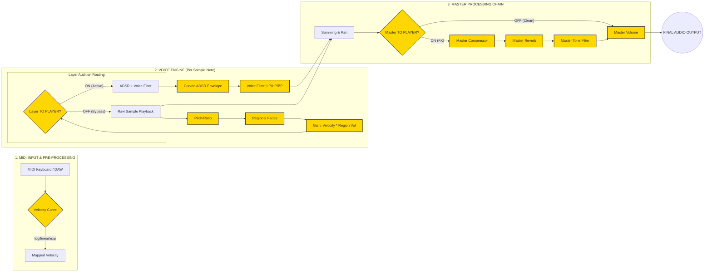

# Audio Signal Flow Analysis (A3 Specification)

This document provides a detailed technical visualization of the `SoteroSamplerSuite` audio engine. It identifies all control points where users can manipulate the signal.

## Signal Flow Diagram (A3 Landscape)

## Control Point Details

### 🟢 Pre-Processing Controls
- **Velocity Curve**: (Header) Choose between `LINEAR`, `LOG`, or `EXP` to adjust touch sensitivity.

### 🟡 Voice/Layer Controls (Developer Level)
- **Root & Fine Tune**: (Region) Sets playback speed and base pitch.
- **Fade In/Out & Start/End**: (Region) Non-destructive sample editing.
- **Region Volume**: (Region) Balance individual samples within a zone.
- **Layer TO PLAYER Toggle**: (Mapping Panel)
    - **OFF**: Bypasses ADSR and Filter for raw monitoring.
    - **ON**: Enables the sculpting tools (ADSR/Filter) for that layer.
- **Curved ADSR**: (Sculpting) Shapes the amplitude over time with custom curves.
- **Voice Filter**: (Sculpting) Independent LP/HP/BP filter per note.

### 🟠 Master controls (User/Player Level)
- **Master TO PLAYER Toggle**: (Header)
    - **OFF**: Skips heavy DSP for low-latency auditioning.
    - **ON**: Routes the signal through the high-quality Master FX chain.
- **Master Compressor**: (Advanced) Controls dynamics and "glues" the sound.
- **Master Reverb**: (Advanced) Spatial depth and room size.
- **Master Tone**: (Advanced) Macro tilt EQ to adjust global brightness/warmth.
- **Master Volume**: (Metadata/Dashboard) Final output gain.

---
> [!TIP]
> **Understanding the "Filtering" Perception**: When you toggle "TO PLAYER" on the **Layer** level, you are activating the ADSR. If your ADSR has a default 10ms Attack, you will hear a loss of transients. This is not a bug, but the activation of the sculpting tools.
